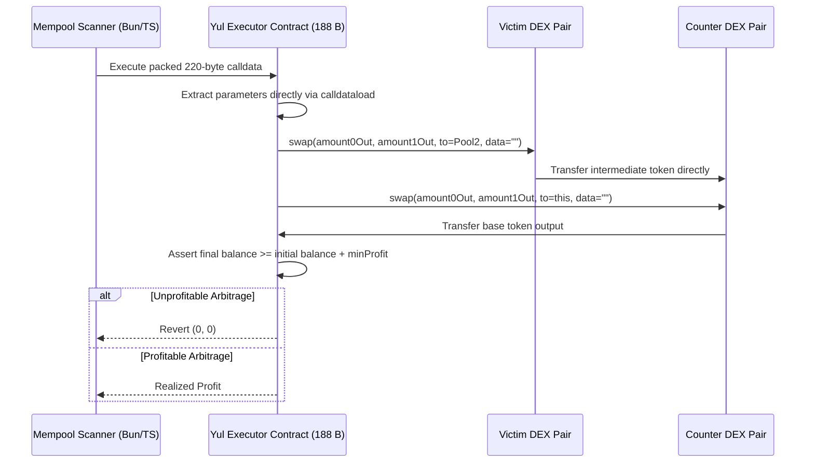

# Quarry MEV Engineering & Yul Optimization Specification

This document details the mathematical model, off-chain mempool scanner architecture, and low-level Yul EVM bytecode optimizations implemented in Quarry.

## AMM Arbitrage Math & Closed-Form Optimal Input

For a two-hop Uniswap V2 cross-DEX arbitrage between Pool 1 (reserves $R_{1,in}, R_{1,out}$) and Pool 2 (reserves $R_{2,in}, R_{2,out}$), both charging fee multiplier $\gamma = 0.997$ (0.3% fee), the optimal input amount $x^*$ that maximizes net round-trip output is derived in closed form:

\[
x^* = \frac{\gamma \sqrt{\gamma \cdot R_{1,in} \cdot R_{1,out} \cdot R_{2,in} \cdot R_{2,out}} - R_{1,in} \cdot R_{2,in}}{\gamma \cdot (R_{2,in} + \gamma \cdot R_{1,out})}
\]

The scanner evaluates candidate mempool transactions, calculates post-victim pool reserves, computes $x^*$, and only proceeds if net profit exceeds total gas and Flashbots bribe costs.

## Bare-Metal Yul Executor (`contracts/src/Executor.yul`)

The on-chain leg is written in pure Yul (188 bytes of runtime bytecode) to minimize EVM gas consumption:

### Gas Optimization Strategies

1. **Direct Pair-to-Pair Transfers**: Pool 1 sends its output directly to Pool 2's contract address (`to = Pool2`). This skips an intermediate ERC20 token transfer back to the executor contract, saving ~25,000 gas.
2. **Zero ABI Function Dispatcher**: Calldata parameters are packed sequentially without standard Solidity 4-byte selector overhead or ABI decoding routines.
3. **Atomic Balance Guard**: Direct `balanceOf(address(this))` checks before and after swaps ensure atomic revert if price slippage closes the arbitrage window.

## Performance Ceilings & Gas Benchmarks

| Metric | Measured Baseline | Target Ceiling | Guard Location |
| --- | --- | --- | --- |
| **Executor Bytecode Size** | 188 bytes | 256 bytes | `contracts/foundry.toml` |
| **Mock Two-Hop Gas** | ~84.5k gas | 100k gas | `contracts/test/Executor.t.sol` |
| **Real Mainnet Fork Gas** | 110,957 gas (~111k) | 130k gas | `contracts/test/ExecutorFork.t.sol` |
